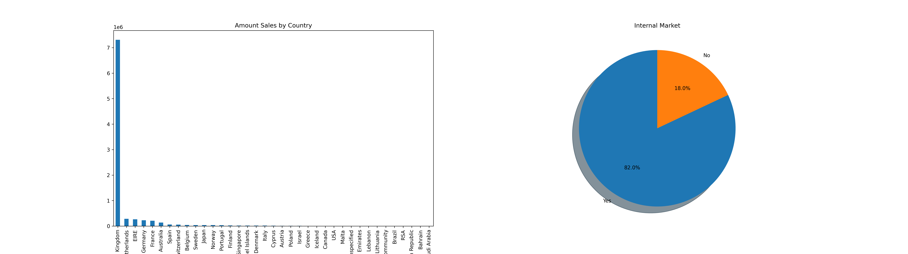

# Market Basket Analysis – Customer Segmentation

This project performs customer segmentation using RFM (Recency, Frequency, Monetary) analysis and KMeans clustering. Visualizations below help understand customer behavior across segments.

---

##  Notebooks

- **`cx_segmentation.ipynb`** – RFM segmentation, KMeans clustering, silhouette analysis, and visual exploration (2D, 3D, boxplots).
- **`customer_segmen.ipynb`** – Data preprocessing, exploratory analysis, QQ-plots, scatter and regression plots.

---

##  Visualizations

### A) Sales by Country

This bar chart shows total sales amount per country, highlighting key markets.



---

### B) RFM Metrics by Cluster (Boxplots)

The following boxplots show distributions of `Amount`, `Frequency`, and `Recency` across clusters. Outliers above the 95th percentile were removed for clarity.

#### Amount (Purchase Value)
| 3 Clusters | 5 Clusters | 7 Clusters |
|------------|------------|------------|
|  |  |  |

**Interpretation:**  
Clusters with higher medians represent customers who spend more. These groups may be prime targets for premium promotions.

#### Frequency (Purchase Frequency)
| 3 Clusters | 5 Clusters | 7 Clusters |
|------------|------------|------------|
|  |  |  |

**Interpretation:**  
Higher medians indicate clusters of frequent buyers—valuable for loyalty campaigns.

#### Recency (Time Since Last Purchase)
| 3 Clusters | 5 Clusters | 7 Clusters |
|------------|------------|------------|
|  |  |  |

**Interpretation:**  
Lower recency values mean customers are recently active; high values signal textatively inactive groups—ideal re-engagement targets.

---

##  Getting Started

```bash
git clone https://github.com/LuisBuruato/Market-Basket-Analysis-.git
