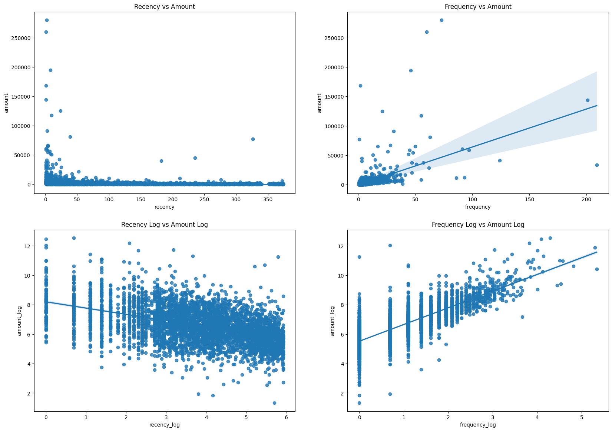

# Market Basket Analysis - Customer Segmentation

This repository contains notebooks and visualizations for **customer segmentation** and **market basket analysis**.

---

## Notebooks

### 1. Customer Segmentation
- [`cx_segmentation.ipynb`](cx_segmentation.ipynb) – Main notebook for **RFM analysis**, **KMeans clustering**, and silhouette evaluation.

### 2. Customer Segmentation (Preprocessing & Plots)
- [`customer_segmen.ipynb`](customer_segmen.ipynb) – Data preprocessing, exploratory analysis, and 2D/3D visualizations.

---

## Visualizations

### 1. 2D RFM Scatter Plots
- File: `graficos_productos/regplots_2D.png`  
- **Explanation:** Shows relationships between Recency, Frequency, and Monetary metrics. Helps visualize how customers cluster based on spending behavior.



---

### 2. Boxplots of RFM Metrics per Cluster
Files in: `graficos_plotly_png/`  

**Explanation:** Boxplots show distribution of **Amount**, **Frequency**, and **Recency** for each cluster. Outliers above the 95th percentile are removed to focus on the main trends.

#### 2.1 Amount Boxplots
- Highlights high vs. low-spending clusters.


#### 2.2 Frequency Boxplots
- Shows which clusters buy more frequently.


#### 2.3 Recency Boxplots
- Helps identify active vs. inactive customers.


---

### 3. Interactive HTML Plots
Files in: `graficos_plotly_html/`  

**Note:** GitHub does not render interactive HTML plots. Open these files locally in a browser to explore interactivity.

- Amount boxplots:
  - `boxplot_amount_3_clusters.html`  
  - `boxplot_amount_5_clusters.html`  
  - `boxplot_amount_7_clusters.html`  
- Frequency boxplots:
  - `boxplot_frequency_3_clusters.html`  
  - `boxplot_frequency_5_clusters.html`  
  - `boxplot_frequency_7_clusters.html`  
- Recency boxplots:
  - `boxplot_recency_3_clusters.html`  
  - `boxplot_recency_5_clusters.html`  
  - `boxplot_recency_7_clusters.html`  

---

## How to Use
1. Clone the repository:
```bash
git clone https://github.com/LuisBuruato/Market-Basket-Analysis-.git
